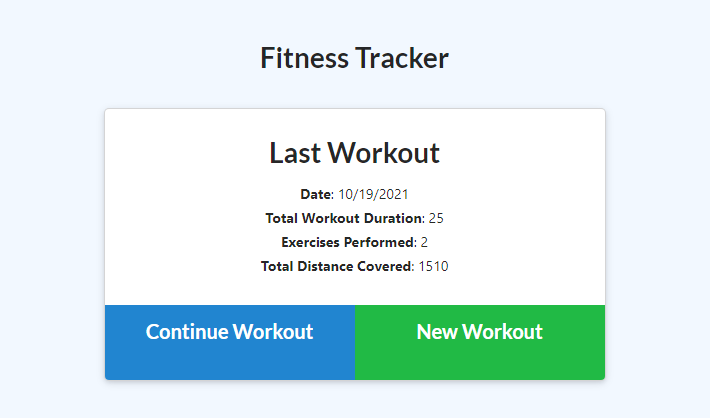

# Unit 18 Nosql Homework: Workout Tracker

Link to deployed app: https://workout-tracker-853654.herokuapp.com/?id=616ca8c944485400161e1286

 

For this assignment, you'll create a workout tracker. You have already been provided with the front end code in the `Develop` folder. This assignment will require you to create Mongo database with a Mongoose schema and handle routes with Express.

## User Story

* As a user, I want to be able to view create and track daily workouts. I want to be able to log multiple exercises in a workout on a given day. I should also be able to track the name, type, weight, sets, reps, and duration of exercise. If the exercise is a cardio exercise, I should be able to track my distance traveled.

## Business Context

A consumer will reach their fitness goals more quickly when they track their workout progress.

## Acceptance Criteria

When the user loads the page, they should be given the option to create a new workout or continue with their last workout.

The user should be able to:

  * Add exercises to the most recent workout plan.

  * Add new exercises to a new workout plan.

  * View the combined weight of multiple exercises from the past seven workouts on the `stats` page.

  * View the total duration of each workout from the past seven workouts on the `stats` page.

> **Important:** Look into using a MongoDB aggregate function to dynamically add up and return the total duration for each workout. Check out the [MongoDB documentation on the $addFields](https://docs.mongodb.com/manual/reference/operator/aggregation/addFields/), the [MongoDB documentation on the $sum operator](https://docs.mongodb.com/manual/reference/operator/aggregation/sum/), and the [Mongoose documentation on aggregate functions](https://mongoosejs.com/docs/api.html#aggregate_Aggregate) to learn how it can be accomplished.

To deploy an application with a MongoDB database to Heroku, you'll need to set up a MongoDB Atlas account and connect a database from there to your application. Be sure to use the following guides for support:

  * [Set Up MongoDB Atlas](../04-Important/MongoAtlas-Setup.md)

  * [Deploy with Heroku and MongoDB Atlas](../04-Important/MongoAtlas-Deploy.md)

## Commit Early and Often

One of the most important skills to master as a web developer is version control. Building the habit of committing via Git is important for the following two reasons:

1. Your commit history is a signal to employers that you are actively working on projects and learning new skills.

2. Your commit history allows you to revert your codebase in the event that you need to return to a previous state.

Follow these guidelines for committing:

* Make single-purpose commits for related changes to ensure a clean, manageable history. If you are fixing two issues, make two commits.

* Write descriptive, meaningful commit messages so that you and anyone else looking at your repository can easily understand its history.

* Don't commit half-done work, for the sake of your collaborators (and your future self!).

* Test your application before you commit to ensure functionality at every step in the development process.

We want you to have well over 200 commits by graduation, so commit early and often!

## Submission on BCS

You are required to submit the following:

* The URL to the deployed application

* The URL to the GitHub repository
